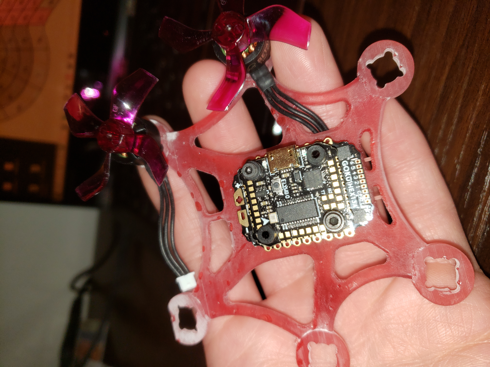
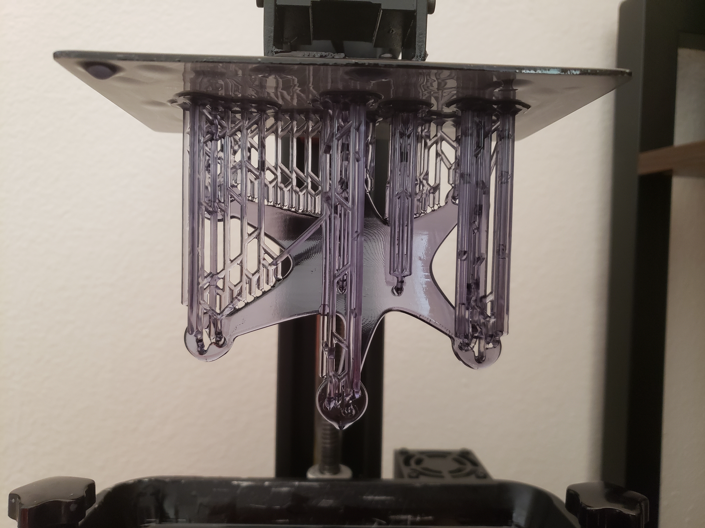
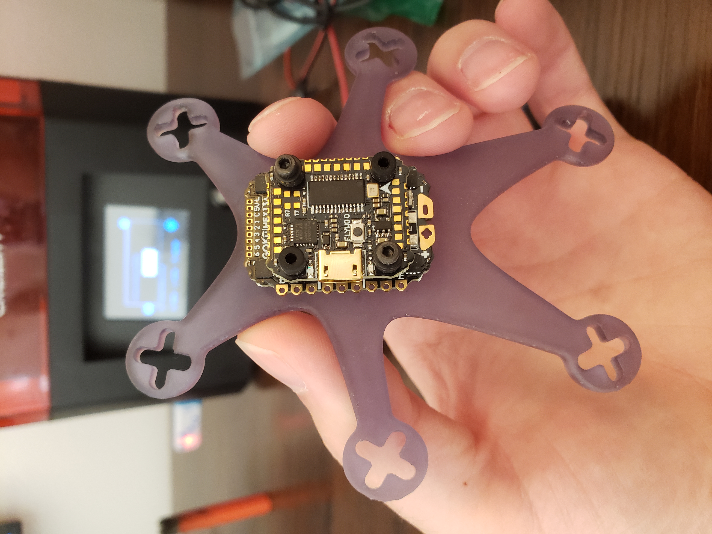
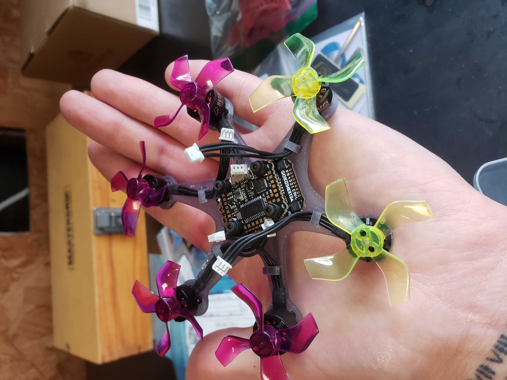
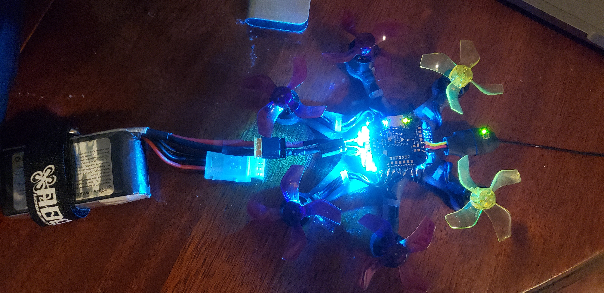

+++
date = 2022-01-01
title = "3D Printed Hexcopter"
description = "Designed and 3D printed a carbon fiber mini hexcopter."
authors = ["Alyn Musselman"]
[taxonomies]
tags = ["Fusion360", "3D Printing"]
[extra]
math = true
image = "frame.png"
+++

## Motivation

I wanted to get into FPV drones, but I thought it would be boring to just buy a drone. So I decided to look into 3D printing them instead. To my suprise, successully printing a performance quadcopter frame is extrmeley difficult. Not only due to force dynamics accross a frame, but also impulse dynamics, flexion, aerodynamics, mass limitations, geometry limitations, etc. Having just purchased a resin 3D printer though, I was able to take advantage of geometries that an FDM printer would be (nearly) incapable of achieving. These geometries allowed me to design a frame that equalized thrust forces with frame torsion/flexion to achieve stable flight dynamics.

## Methodology

Insofar as I am aware, I am the only person to have designed and 3D printed a micro hexacopter. Thus, being the first, my only goal was to create a proof of concept. 

I didn't really have a clear picture of what I wanted the design to look like, so I decided to think about features that would be required for function. These variables would drive parameters of the frame. Driving variables for say, frame size, would be determined by the off-the-shelf parts I purchased like baterries and circuits. Another equally important variable would be thrust output from the motor-blade combination I chose. This variable would determine the ideal material properties of the "arms" on the frame, like how stiff they needed to be, which is a function of their aspect ratio (length vs thickness).

I decided to first designed a frame that accepted the FC+ESP I purchased (Flywoo GOKU HEX GN405 Nano 13A STACK). Another element that would determine the frame size was the baterry. Since I wanted this drone to be as small as possible, a 1S baterry would be used. Lastly, the motors would determine the profiles of the end of the "arms".

My personal prototyping process typically begins with guarenteeing dimensions. So naturally the first model I printed was primarily to verify fitment and appealing proportions of the aforementioned parts, and it looked like this:

It was not pretty, and it revealed plenty of design flaws that I had unknowingly introduced into the design of this project. Luckily, that is the entire purpose of R&D. I course corrected, and after something like 10 CAD prototypes I found one I liked enough to print:

This model was much more realistic. The geometries showcased the abilities of the resin printer, the mass was minimilized, and its proportions were more appealing. 

After a few more finishing touches, I was able to get the final result!

## Results

Unfortunately, like some of the other projects in this library, this one has taken a back seat while I finish my academic career. Currently, the only remaining tasks for me to finish on this project are firmware related. I need to download, learn, and use BetaFlight to flash the reciever on the drone, as well as my controller.