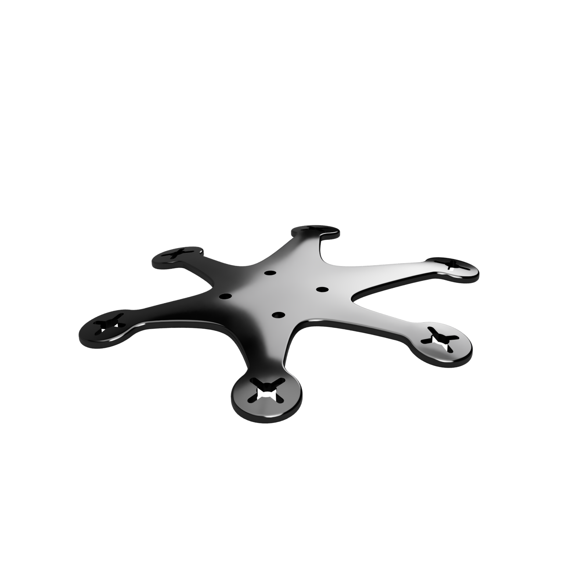
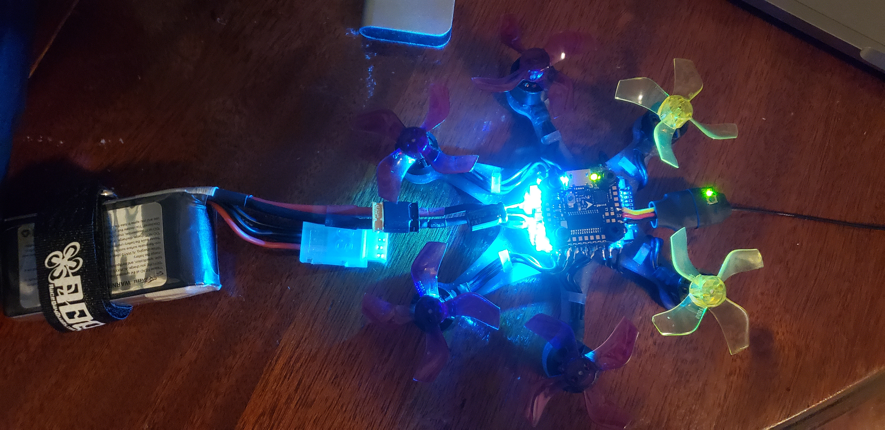

+++
date = 2022-01-01
title = "3D Printed Hexcopter"
description = "Designed and 3D printed a carbon-fiber micro hexcopter."
authors = ["Alyn Musselman"]
[taxonomies]
tags = ["Fusion360", "3D Printing"]
[extra]
math = true
image = "drone5.jpg"
+++

## Motivation

I wanted to get into FPV drones, but buying one off the shelf felt boring, so I
decided to design and 3D print my own instead. To my surprise, printing a
performance multirotor frame turns out to be extremely difficult — it isn't just
a matter of geometry. A frame has to survive steady thrust loads, the impulse
loading of hard maneuvers and crashes, torsional flex, and aerodynamic drag, all
while staying as light as possible. Every one of those constraints pulls the
design in a different direction.

What made the project feasible was the resin printer I had just bought. Resin
(SLA) printing resolves fine features and complex curved geometries that a
filament (FDM) printer can't reliably produce, and it does so without the weak
layer-adhesion planes that make FDM parts split under load. Those capabilities
let me design a frame that balances thrust forces against frame torsion and
flexion, which is the key to stable flight: if the arms flex unpredictably under
load, the flight controller is constantly fighting a moving target.

## Methodology

As far as I'm aware, I'm the only person to have designed and 3D printed a micro
*hexacopter* specifically, so with no prior art to copy my goal was simply a
working proof of concept.

I didn't start with a fixed picture of the final shape. Instead I worked
backwards from function: I listed the features the frame had to provide, and let
those requirements drive its parameters. The overall frame size, for instance,
was set by the off-the-shelf parts I had to package — the flight controller stack
and the battery. The arm design, on the other hand, was driven by thrust: the
motor-and-propeller combination determined how much force each arm had to carry,
which in turn set the stiffness the arms needed, and therefore their aspect ratio
(length versus cross-sectional thickness).

Concretely, the build was organized around three component choices:

- **Flight controller / ESC stack** — a Flywoo GOKU HEX GN405 Nano 13A stack,
  whose mounting footprint fixed the size of the frame's center body.
- **Battery** — a single-cell (1S) pack, chosen to keep the craft as small and
  light as possible.
- **Motors and propellers** — these set the thrust per arm, and so dictated the
  profile and stiffness of each arm tip.

My prototyping process usually begins by locking down dimensions, so the first
print existed only to verify fitment and proportions of those parts rather than
final aesthetics. It was not pretty, and it surfaced plenty of design flaws I
hadn't realized I'd baked in — which is exactly what a first prototype is for.

I course-corrected through roughly ten CAD iterations before landing on a design
worth committing to. Each revision traded a little against the others: thinning
the arms to save mass, then thickening them again where flex showed up; reshaping
the body to fit the stack more tightly; refining the curves to take advantage of
what the resin printer could actually hold. The result was far more realistic —
the geometry showed off the resolution of the resin process, the mass was
minimized, and the proportions finally looked right.

After a few more finishing touches, I had a complete airframe with the
electronics installed:

## Results

The mechanical and design side of the project is essentially complete: the frame
prints cleanly, packages all of the electronics, and holds together as intended.
Like several other projects in this library, the remaining work has taken a back
seat to finishing my academic career, and what's left is entirely on the firmware
side. To get it flying I still need to set up BetaFlight, flash and configure the
flight controller, and bind the receiver to my transmitter so the craft can be
armed and tuned. Those are well-trodden steps for a standard build — the hard,
novel part, designing a printable micro hexcopter frame that flies, is done.
