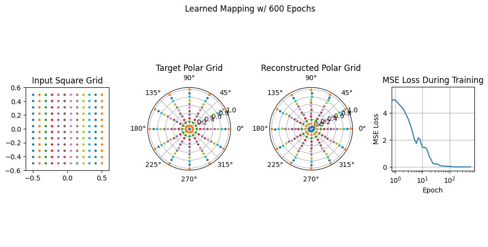

+++
date = 2024-09-10
title = "Homeomorphic AutoEncoder"
description = "A failed first attempt at learning a homeomorphic map between coordinate systems — and why the idea is still worth chasing."
authors = ["Alyn Musselman"]
[taxonomies]
tags = ["Pytorch", "math"]
[extra]
math = true
image = "grid_output.png"
+++

## Motivation

A *homeomorphism* is a continuous, invertible map between two spaces whose inverse
is also continuous — intuitively, a way to smoothly deform one shape into another
without tearing or gluing. What makes homeomorphisms between **coordinate systems**
so appealing is that they let you do hard work in an easy space and carry the
answer back.

The concrete payoff is in solving differential equations. Numerical methods are
far simpler on a regular Cartesian grid — a plain square mesh — than on an awkward
domain like a disk or an annulus. If you had a homeomorphic map between a square
grid and, say, a polar grid, you could solve your equation on the friendly square,
then map the solution onto the polar domain where you actually need it. Mesh
generation, finite-difference stencils, boundary conditions: all of it gets easier
if you can move freely between coordinate systems. That is the dream that started
this project — could a neural network *learn* such a map directly from data?

The honest answer this post arrives at is: **not the way I tried it here.** This
was a failed experiment. But the failure is instructive, and the motivation is
strong enough that I'm planning a better attempt.

## Methodology

I framed the problem as learning the map from a **square grid** to a **polar
grid**. The two point sets are generated directly:

```python
# square grid
x = np.linspace(-.5, .5, n_points_per_edge)
X, Y = np.meshgrid(x, x)

# polar (target) grid
theta = np.linspace(0, 2*np.pi, n_points_per_edge, endpoint=False)
r     = np.linspace(0, 1, n_points_per_edge)
radius_matrix, theta_matrix = np.meshgrid(r, theta)
```

The model is a small PyTorch "autoencoder": an encoder that takes a 2D point down
through hidden layers to a 2D latent code, and a decoder that expands it back to
2D.

```python
class Autoencoder(nn.Module):
    def __init__(self):
        super().__init__()
        self.encoder = nn.Sequential(
            nn.Linear(2, 64), nn.ReLU(),
            nn.Linear(64, 32), nn.ReLU(),
            nn.Linear(32, 2))           # latent space
        self.decoder = nn.Sequential(
            nn.Linear(2, 32), nn.ReLU(),
            nn.Linear(32, 64), nn.ReLU(),
            nn.Linear(64, 2))           # back to (x, y)

    def forward(self, x):
        return self.decoder(self.encoder(x))
```

Training is a plain regression: feed in the square-grid points, ask for the
polar-grid points, and minimize mean-squared error with Adam over a few hundred
epochs.

```python
output = autoencoder(square_grid_points)
loss   = criterion(output, polar_grid_points)   # MSE against the target grid
```

I also rendered the morph as an animation, watching the square grid deform toward
the target polar grid frame by frame as training progressed.

## Results

On the surface it looks like it works. The MSE loss falls steadily and the
reconstructed polar grid lands roughly on top of the target.



But this is exactly where the experiment fails its own goal. What the network
actually learned is **not a homeomorphism** — it's a lookup table. A few things
went wrong, and they're baked into the setup:

- **Nothing enforces the map's defining properties.** A homeomorphism must be
  continuous *and* invertible *with a continuous inverse*. MSE regression imposes
  none of that. The model is free to learn a mapping that is discontinuous between
  the sampled points, or non-invertible, and the loss won't care.
- **It memorizes a finite point correspondence.** The network only ever sees the
  fixed set of grid points and their fixed targets, so it fits those pairs rather
  than a *function* defined everywhere on the square. Hand it a point that isn't
  one of the training samples and there's no reason its image is meaningful.
- **The "autoencoder" framing is cosmetic.** A real autoencoder compresses to a
  latent space and reconstructs its *input*; here both halves are just an MLP
  regressing input → different target, so the encoder/decoder split buys nothing
  and there's no learned inverse map to carry solutions back the other way.

So while the picture is encouraging, the result is not a usable coordinate
transform: I can't take an arbitrary field on the square, push it through, and
trust the polar version. As a tool for solving PDEs across coordinate systems —
the entire point — it doesn't deliver.

## What's Next

The motivation hasn't gone anywhere; only the architecture was wrong. A grid is
naturally a **graph** — nodes connected to their neighbors — and the property I
actually care about (local continuity, neighbors staying neighbors) is exactly the
kind of structure a graph neural network is built to respect. Now that I've
started learning about GNNs, my next attempt will be to learn this square-to-polar
mapping with a graph neural network, where the connectivity of the grid is part of
the model rather than something MSE has to accidentally rediscover. That feels like
the right tool for turning this failed experiment into a working one.
