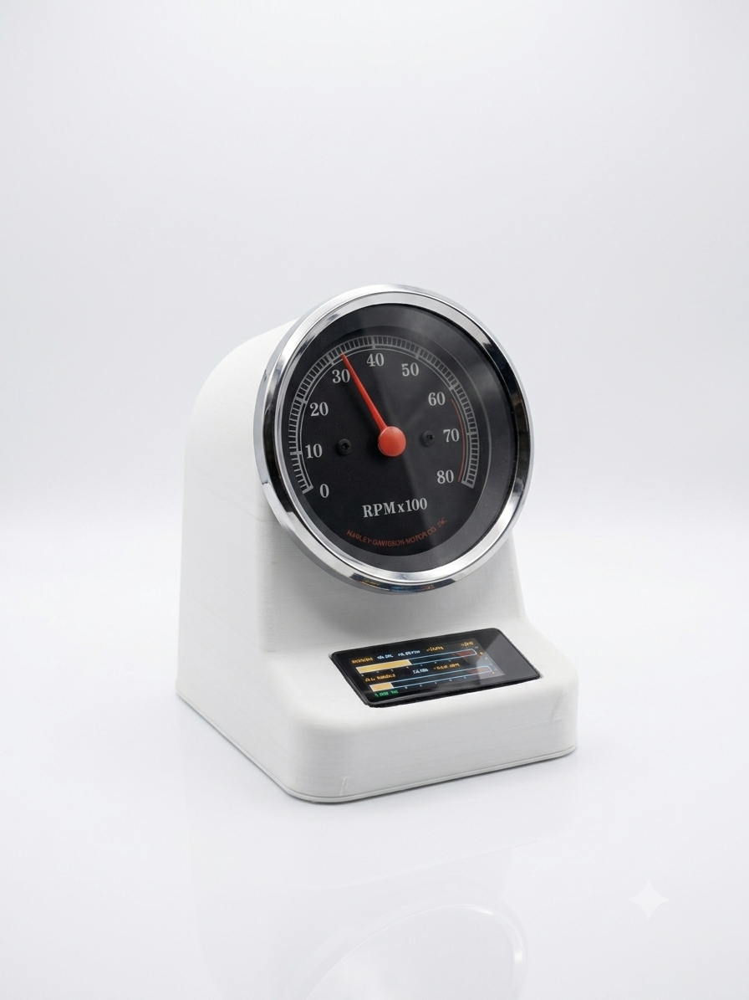

+++
date = 2026-08-18
title = "Clauke"
description = "A vintage Harley-Davidson tachometer, repurposed as a physical desktop gauge for Claude usage and system stats."
authors = ["Alyn Musselman"]
[taxonomies]
tags = ["ESP32", "Arduino", "Python", "Bluetooth", "3D Printing"]
[extra]
math = false
image = "photoshoot.png"
+++

## Motivation

I wanted a way to keep an eye on Claude Code usage and my machine's vitals
without another menu bar percentage competing for attention. A gauge you
glance at, rather than a number you have to parse, felt like the right
interface — and I had a real Harley-Davidson tachometer sitting around from
one of the [motorcycles](@/blog/Motorcycles/index.md) I've rebuilt over the
years. Motorcycle tachs are simple, elegant, purely mechanical-looking
instruments, but under the dial they just count ignition pulses. If I could
generate the right pulse train, nothing would stop the needle from tracking
CPU load, memory pressure, or a Claude session's percent-to-limit instead of
engine RPM.

Clauke is the result: a battery-powered ESP32 gadget that drives a real
tachometer needle from live data, paired with a touchscreen for context and a
Mac menu bar app that feeds it.



## Methodology

### Emulating the tach's ignition signal

A Harley tachometer expects one pulse per engine revolution — that's the
entire interface. To make the needle move, an ESP32-S3 outputs calibrated
pulses on a GPIO pin, which drive a 2N2222 transistor wired as a switch: base
through a ~1k resistor off the GPIO, emitter to ground, collector to the
tach's signal line with a 1k pull-up to a boosted 12V rail (the gauge wants
automotive-ish voltage, not the ESP32's 3.3V logic). An MT3608 boost converter
steps the LiPo's ~3.7–4.2V up to that 12V rail, and a small cap across the
signal line smooths the needle at idle so it doesn't chatter between pulses.

```
TP4056 USB charging module
   │
Battery
   │
   ├──> ESP32 board
   │
   ├──> MT3608 boost → 12V
   │                     │
   │                     ├──> Tach +12V
   │                     │
   │                     └──> Pullup resistor
   │                               │
   │                          Tach Signal
   │                               │
   │                         Collector
   │                            2N2222
   │                         Emitter
   │                            GND
ESP32 GPIO ──> Base resistor ──> 2N2222
```

Pulse width scales with RPM — wider at idle — which keeps the needle steady
rather than jittery at low readings. The mapping itself is deliberately
mechanical-feeling: 0–80% of whatever metric is selected maps linearly to
0–8000 RPM, so 80% lands exactly on the tach's 8k redline mark. Below roughly
500 RPM the needle rests at true zero, and above 80% it doesn't just pin —
it shakes against the redline the way a real engine bounces off a rev
limiter. The needle is always live and simply follows whichever page is
active; there's no separate on/off state for it.

### Five pages, one touchscreen

The enclosure is 3D printed and holds the tach, an ESP32-S3 board with a
built-in AMOLED touchscreen, and the battery and charging circuit. Swiping
up or down anywhere on the screen pages through five views (borderless dots
down the right edge show position):

- **OVERVIEW** — an at-a-glance summary of usage, battery, and CPU. The tach
  needle parks here, so this page doubles as a "sleep" state.
- **RIDE** — the Claude usage feed: session percent (drives the needle,
  rendered as a moto-style gauge bar with a redline), burn rate, and reset
  time, plus the all-models weekly percent and its own reset. Falls back to
  a "NO DATA" state after ten minutes of silence from the host.
- **SYS** — retro CPU / GPU / MEM / TEMP bars pulled from the host machine.
  Tapping a bar selects which metric drives the needle (CPU by default).
- **LIPO** — real battery percentage and voltage, read off the divider on
  GPIO1, with a charging-bolt indicator when powered over USB.
- **TEST** — sweeps 0–8000 RPM, or holds a fixed RPM if you tap the left
  half of the screen — mostly there for calibrating the pulse driver against
  a multimeter.

Firmware runs on an ESP32-S3 (Arduino_GFX for the display, NimBLE-Arduino for
the wireless side). It exposes a GATT server advertised as `HD-TACH`: a
`CMD` characteristic the host writes usage/system lines to, and a `BATT`
characteristic that notifies battery percent on change. If BLE drops, the
firmware just re-advertises — no reboot required.

### The host: a Mac menu bar app

`clauke.py` is a single-file Python program with two personalities. Run
without arguments, it launches as a `rumps`-based menu bar app that owns the
link to the gauge: it prefers Bluetooth (scanning for the `HD-TACH` service
UUID via `bleak`), and if nothing turns up it falls back automatically to USB
serial, matching the board by its Espressif USB vendor ID rather than a
volatile `/dev` name. A `--cli` flag switches it to a plain serial loop for
testing without importing `rumps`/`bleak` at all.

<div style="display:flex;gap:1.5rem;align-items:center;flex-wrap:wrap;margin:1.5rem 0;">


</div>

The menu bar icon on the right is a macOS *template* image — flat black
shapes on a transparent background — so the OS can tint it automatically for
light and dark menu bars; the app icon on the left is the full-color mark
used for the packaged `.app`. Dropping a replacement `menubar_icon.png` into
`host/assets/` is picked up automatically, no rebuild needed.

The interesting part of the host is how it turns Claude usage into a live
number without hammering the API. A background thread estimates usage
locally every five seconds from `ccusage`'s active-block token count, and
checks in against the authoritative OAuth usage endpoint only once every
three minutes — snapping the estimate back to truth whenever the two
disagree by more than 10 points:

```python
def poll(self, now=None):
    now = time.time() if now is None else now

    if now - self.last_verify >= VERIFY_S:
        a = fetch_actual()
        if a:
            self.actual = a
            self.last_verify = now
            tokens = fetch_block_tokens()
            if tokens and a["session_pct"] > 1.0:
                self.limit_tokens = tokens / (a["session_pct"] / 100.0)

    session_pct = self.actual["session_pct"] if self.actual else 0.0
    if self.limit_tokens:
        tokens = fetch_block_tokens()
        if tokens is not None:
            est = min(100.0, tokens / self.limit_tokens * 100.0)
            if self.actual and abs(est - self.actual["session_pct"]) > DISCREPANCY_PCT \
                    and now - self.last_verify < VERIFY_S:
                session_pct = self.actual["session_pct"]  # distrust the estimate
            else:
                session_pct = est
    ...
```

That estimate, plus CPU/GPU/MEM/temperature from `psutil`, gets written to
the wire as two plain ASCII lines — `D,<sessPct>,<sessReset>,<ratePctHr>,
<weekPct>,<weekReset>` and `S,<cpuPct>,<gpuPct>,<memPct>,<tempC>` — sent over
whichever transport is currently connected. The battery percentage flows the
other direction, from device to host, over the same serial line or a BLE
notify. For day-to-day use, `host/setup.py` packages the whole thing with
`py2app` into a standalone `Clauke.app` — `LSUIElement` is set, so it runs
with no Dock icon and no Cmd-Tab entry, just the menu bar glyph.

## Bill of Materials

| Component | Part | Notes |
|---|---|---|
| Controller | [ESP32-S3 AMOLED dev board](https://www.waveshare.com/esp32-s3-amoled-1.91.htm?sku=28871) | Drives the tach + touchscreen, handles BLE/USB |
| Battery | Single-cell Li-ion (18650 or LiPo) | Powers the whole gadget |
| Battery holder | [Wired battery pack](https://www.amazon.com/gp/product/B07XFPSVRS/ref=ewc_pr_img_3?smid=ACRAF3O0AXJNI&psc=1) | Holds the cell, brings out leads |
| Boost converter | [MT3608](https://www.amazon.com/gp/product/B089JYBF25/ref=ewc_pr_img_1?smid=A3CX4TQNUXMB0L&psc=1), set to 12V | Powers the tach's signal/lamp rail |
| Pulse driver | 2N2222 transistor | Emulates the ignition pulse the tach expects |
| Gauge | Vintage Harley-Davidson tachometer | The reused instrument itself |
| Enclosure | Custom 3D-printed housing | Holds gauge, board, and battery |

## Results

The electronics and firmware side is done: the needle tracks live data
convincingly, complete with the redline shake, and the BLE/USB fallback
means the gauge reconnects on its own whether or not the Mac happens to be
in range. The menu bar app is the daily driver — it's the thing that's
actually running while I work, quietly estimating usage between the
authoritative checks and pushing it to the gauge over whatever link is up.

A couple of things are still on the list rather than fully nailed down: the
LiPo voltage divider's resistor values came off a flattened PDF extraction
of the schematic rather than a trace-by-eye or a multimeter reading, so the
LIPO page's percentage is closer than not but wants verification against a
real battery. And GPU percent and CPU temperature both need privileged
tooling (`powermetrics` via `sudo`) that the host doesn't invoke yet, so SYS
shows `--` for those two on macOS for now. Neither blocks daily use — the
gauge sits on my desk, needle live, telling me what my session and my
machine are doing without a single glance at a menu bar number.
