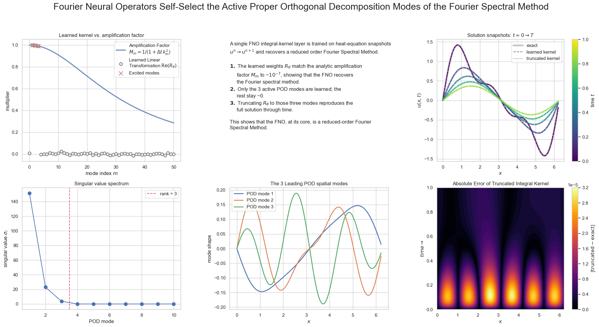
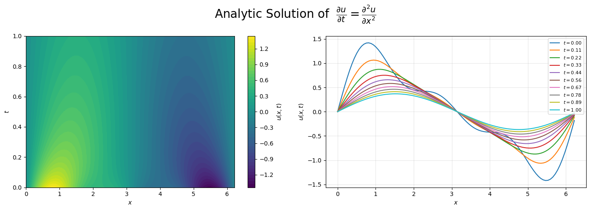
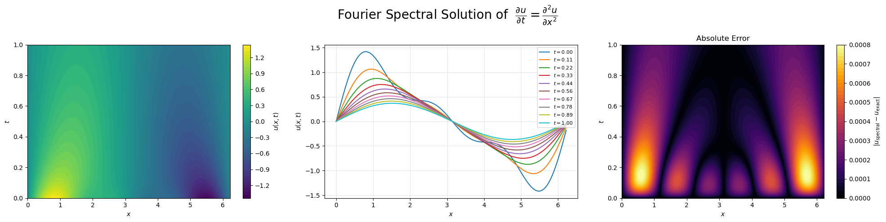
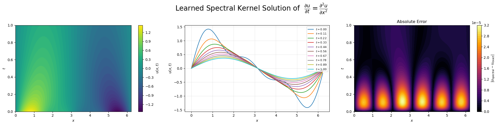
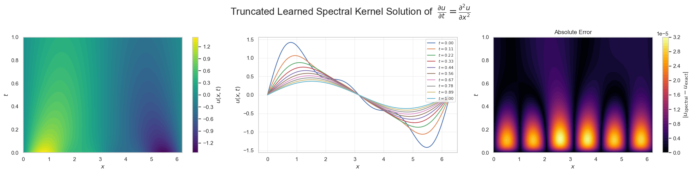

+++
date = 2026-06-20
title = "Fourier Neural Operators Are a Reduced-Order Spectral Method"
description = "A single FNO layer trained on the heat equation rediscovers the analytic amplification factor and self-selects the active POD modes."
authors = ["Alyn Musselman"]
[taxonomies]
tags = ["Pytorch", "math"]
[extra]
math = true
image = "poster.png"
+++

## Abstract

A Fourier Neural Operator (FNO) learns a mapping $G_\theta : A \to U$ between
function spaces. Here I show that, with a few modifications, a single FNO layer
reduces to the canonical **Fourier spectral method**. A single FNO
integral-kernel layer is trained on heat-equation snapshots $u^n \to u^{n+1}$,
with no physics supplied, and the result is striking:

1. The learned weights $R_\theta$ match the analytic **amplification factor**
   $M_m = 1/(1 + \Delta t\, k_m^2)$ to ~$10^{-7}$, showing the FNO recovers the
   Fourier spectral method.
2. Only the active POD modes ($k = 1, 2, 3$) are learned; the rest stay ~0.
3. Truncating $R_\theta$ to those three modes reproduces the full solution
   through time.
4. Taken together: the FNO, at its core, is a reduced-order Fourier spectral
   method.



## The Fourier Spectral Method

On a periodic grid of $N$ points, the discrete Fourier transform (DFT) pair is

$$
\hat{u}_m = \sum_{j=1}^{N} u_j\, e^{-i k_m x_j},
\qquad
u_j = \frac{1}{N}\sum_{m} \hat{u}_m\, e^{i k_m x_j},
$$

where $u_j = u(x_j)$ is the field sampled at grid point $x_j$; $\hat{u}_m$ is the
$m$-th Fourier coefficient ($-N/2 < m \le N/2$); and $k_m = 2\pi m / L$ is the
wavenumber of mode $m$ on a domain of length $L$. Differentiation is **diagonal**
in this basis:

$$
\frac{\partial}{\partial x} \to i k_m,
\qquad
\frac{\partial^2}{\partial x^2} \to -k_m^2,
$$

so each spatial derivative becomes a multiplication of $\hat{u}_m$ by a known
function of $k_m$ — the source of the method's spectral accuracy.

## The FNO Layer and Integral Kernel Operator

A single FNO layer maps $v_\ell(x) \mapsto v_{\ell+1}(x)$ via

$$
v_{\ell+1}(x) = \sigma\!\Big( W v_\ell(x) + (\mathcal{K} v_\ell)(x) \Big),
$$

with activation $\sigma$, local linear transform $W$, and **integral kernel
operator** $\mathcal{K}$ applied in Fourier space:

$$
(\mathcal{K} v_\ell)(x) = \mathcal{F}^{-1}\!\big(\, R_\theta \cdot \mathcal{F}(v_\ell)\, \big).
$$

Here $R_\theta$ is a **learned** complex weight per retained mode. The operator's
structure is: FFT $\to$ multiply each mode by a weight $\to$ inverse FFT.

## Connecting $M_m$ and $R_\theta$

The kernel operator begins with an FFT and ends with an inverse FFT, with a
per-mode multiplication between — exactly the structure of a spectral update,
$u^{n+1} = \mathcal{F}^{-1}(M_m \cdot \mathcal{F}(u^n))$. They are the same
operation; only the multiplier's origin differs: $R_\theta$ is **learned**,
$M_m$ is the **analytic amplification factor** of the PDE update. We recover the
spectral method by dropping $\sigma$ and $W$, keeping all modes, and setting
$R_\theta = M_m$.

## The Heat Equation

On a periodic domain,

$$
\frac{\partial u}{\partial t} = \frac{\partial^2 u}{\partial x^2}.
$$

**Analytic solution.** With $u(x,t) = \hat{u}_m(t)\,e^{i k_m x}$, each mode obeys
$\dot{\hat{u}}_m = -k_m^2 \hat{u}_m$, so $\hat{u}_m(t) = \hat{u}_m(0)\,e^{-k_m^2 t}$.
For the initial condition $u(x,0) = \sin(x) + 0.5\sin(2x) + 0.3\sin(3x)$ this
gives the closed form (our ground truth)

$$
u(x,t) = e^{-t}\sin(x) + 0.5\,e^{-4t}\sin(2x) + 0.3\,e^{-9t}\sin(3x),
$$

which excites exactly three wavenumbers, $k = 1, 2, 3$.



**Spectral solution.** The DFT sends $\partial_{xx} \to -k_m^2$, giving
$\dot{\hat{u}}_m = -k_m^2 \hat{u}_m$. A backward (implicit) Euler step,
$(\hat{u}_m^{\,n+1} - \hat{u}_m^{\,n})/\Delta t = -k_m^2 \hat{u}_m^{\,n+1}$,
yields

$$
\hat{u}_m^{\,n+1} = M_m\, \hat{u}_m^{\,n},
\qquad
M_m = \frac{1}{1 + \Delta t\, k_m^2},
$$

the amplification factor that $R_\theta$ must reproduce.

```python
uhat = np.fft.fft(u0)                 # FFT of initial condition (once)
M    = 1.0 / (1.0 + dt * k**2)        # amplification factor per mode
for n in range(nsteps):
    uhat = uhat * M                   # backsolve in Fourier space
u = np.real(np.fft.ifft(uhat))        # inverse FFT to physical space
```



## Results

I train a single integral-kernel layer (no $W$, no activation) on the snapshot
pairs $u^n \to u^{n+1}$ generated above, learning one complex weight $R_\theta$
per Fourier mode.

**The FNO recovers the spectral method.** On the modes the data actually excites
($k = 1, 2, 3$), the learned weights match the analytic amplification factor,
$R_\theta = M_m$, to ~$10^{-7}$. The network rediscovers
$1/(1 + \Delta t\, k_m^2)$ from data alone.



**The FNO self-selects the active modes.** A proper orthogonal decomposition
(POD) of the solution trajectory shows it is rank 3: only three singular values
are nonzero, and the leading POD modes are exactly $\sin x, \sin 2x, \sin 3x$.
The heat equation is linear and diagonal in Fourier space, so unexcited modes
start at zero and stay there — during training those weights receive no gradient
and remain ~0. The layer therefore learns only the modes it needs, which is
precisely the subspace POD identifies.

**Truncation is lossless.** Zeroing every weight outside $k = 1, 2, 3$ and
rolling the kernel forward reproduces the full solution through time to the same
~$10^{-7}$ accuracy. A three-parameter spectral kernel captures the entire
dynamics — the FNO, at its core, is a reduced-order Fourier spectral method.


