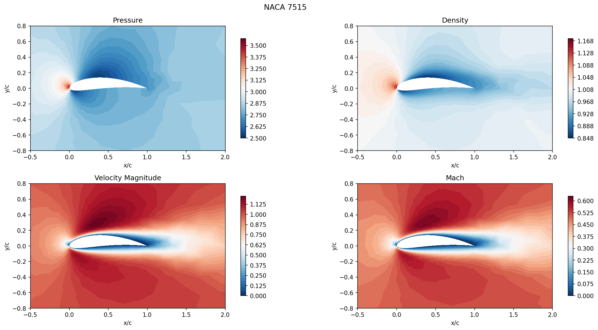
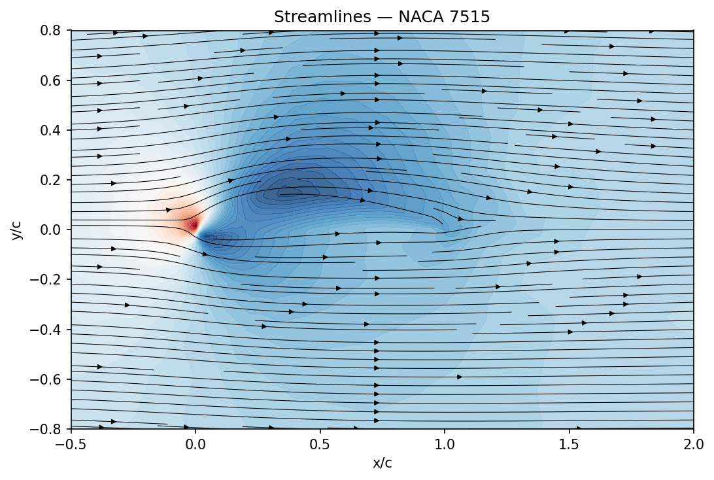
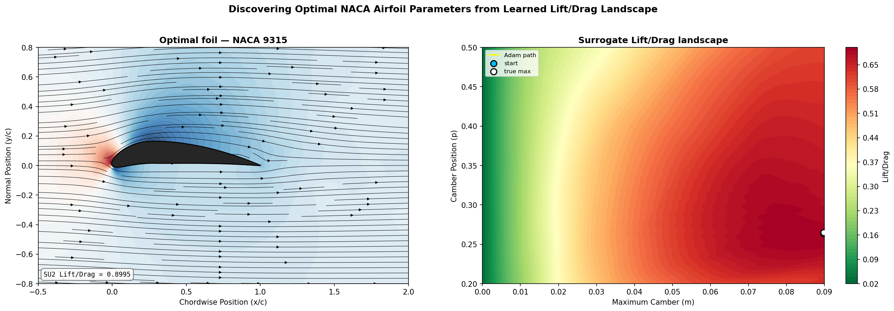

+++
date = 2026-06-08
title = "Gradient-Based Airfoil Optimization with Graph Convolutional Networks"
description = "A differentiable GCNN surrogate for CFD that optimizes airfoil shape directly through backpropagation."
authors = ["Alyn Musselman"]
[taxonomies]
tags = ["Pytorch", "math"]
[extra]
math = true
image = "run_summary.png"
+++

## Motivation

Aerodynamic shape optimization is expensive. The usual loop wraps a CFD solver
inside a black-box optimizer: propose a shape, mesh it, solve the Navier–Stokes
equations, read off the lift-to-drag ratio, and repeat. Each evaluation costs
minutes of solver time, and because the optimizer treats the solver as a black
box it has no access to gradients — it must approximate them with finite
differences or fall back on derivative-free search.

This project recreates the results of Shukla, Oommen, Peyvan et al., but
replaces their DeepONet surrogate with a **Graph Convolutional Neural Network
(GCNN)**. The goal is a *differentiable* approximation to the CFD solver: once
the surrogate is trained, the gradient of the lift-to-drag ratio with respect to
the shape parameters is available directly through autograd, so the optimal
airfoil can be found by plain gradient descent rather than a black-box search.

Concretely, the problem is to find the NACA 4-digit parameters $(p, m)$ — the
position and magnitude of maximum camber — that maximize the lift-to-drag ratio
$L/D$ of a 2D airfoil in steady, subsonic, viscous flow.

## Governing Equations

The flow is governed by the 2D compressible Navier–Stokes equations:

$$
\frac{\partial \rho}{\partial t} + \nabla \cdot (\rho \mathbf{u}) = 0,
$$

$$
\frac{\partial (\rho \mathbf{u})}{\partial t} + \nabla \cdot (\rho\, \mathbf{u} \otimes \mathbf{u} + p\mathbf{I}) = \frac{1}{\mathrm{Re}}\, \nabla \cdot \boldsymbol{\tau},
$$

$$
\frac{\partial E}{\partial t} + \nabla \cdot \big((E + p)\mathbf{u}\big) = \frac{1}{\mathrm{Re}}\, \nabla \cdot (\boldsymbol{\tau}\mathbf{u} + \kappa \nabla T),
$$

where $\rho$ is density, $\mathbf{u}$ the velocity vector, $p$ pressure, $E$
total energy, $\boldsymbol{\tau}$ the viscous stress tensor, and $\kappa$ the
thermal conductivity. Lift and drag follow from integrating pressure and wall
shear stress over the airfoil surface.

## Generating Training Data with SU2

Ground-truth flow fields come from [SU2](https://su2code.github.io/), an
open-source CFD solver that solves the compressible Navier–Stokes equations on
unstructured meshes. SU2 produces the full volumetric field ($u, v, p, \rho, T$)
as well as the surface quantities ($C_p$, $C_f$) needed for the surrogate's
labels. The pipeline for each airfoil is:

1. Generate surface coordinates from the NACA equations.
2. Mesh the flow domain with Gmsh (a body-fitted unstructured triangular mesh).
3. Run SU2 with a config specifying $\mathrm{Re}$, $\mathrm{Ma}$, angle of attack, and boundary conditions.
4. Extract surface $C_p$, $C_f$ and integrated $C_L$, $C_D$ from the output.

The whole thing is scripted in Python via subprocess, so the full dataset is
generated automatically — each run takes roughly one to five minutes depending on
mesh resolution.

### Solver configuration

| Parameter | Value | Notes |
|---|---|---|
| Solver | Laminar Navier–Stokes | No turbulence model |
| Spatial scheme | Roe upwind | 2nd order, MUSCL reconstruction |
| Slope limiter | Venkatakrishnan | Stabilizes near gradients |
| Time integration | Implicit (FGMRES + ILU) | Marched to steady state |
| CFL number | 0.5 | Conservative; suitable for low Re |
| Convergence | RMS($\rho$) ≤ 1e-8 | Max 10,000 iterations |
| Domain | $[-3, 11] \times [-3, 3]$ | Matching Shukla et al. |
| Flow conditions | Re = 500, Ma = 0.5, AoA = 0° | |

The training set is 100 NACA 4-digit airfoils drawn uniformly over
$p \in [0.2, 0.5]$, $m \in [0.0, 0.09]$ with thickness fixed at $t = 0.15$,
split 60 train / 40 test. Each airfoil is sampled at 100 cosine-spaced surface
points and stored as a graph: nodes are surface points, edges connect adjacent
points along the boundary curve.

## The Differentiable Surrogate

The surrogate is a graph convolutional network operating on the 1D boundary
curve of the airfoil. Each node is a surface point with features
$(x, y, \kappa, \varphi)$ — position, local curvature, and normal angle — and
graph convolution amounts to message-passing along arc length.

| Component | Detail |
|---|---|
| Node features | $x, y, \kappa, \varphi$ (4 features) |
| GCN layers | 4 × GCNConv, residual connections, BatchNorm |
| Hidden dim | 128 |
| Activation | ReLU |
| Output | per-node $(C_p, C_{fx}, C_{fy})$ |

### Recovering L/D from the network output

Let $\Phi_\theta$ denote the trained GCNN and $\mathbf{x} = (m, p)$ the shape
parameters. The network predicts per-node fields
$\{\tilde{C}_p, \tilde{C}_{fx}, \tilde{C}_{fy}\}$, which are integrated over the
surface to recover $L/D$. For each panel between adjacent nodes $i$ and $i+1$:

$$
\Delta s_i = \sqrt{(x_{i+1}-x_i)^2 + (y_{i+1}-y_i)^2}, \qquad
\hat{\mathbf{n}}_i = \frac{(-\Delta y_i,\ \Delta x_i)}{\Delta s_i},
$$

$$
\tilde{C}_{Li} = \big(-\tilde{C}_p^{\,\text{mid}}\, \hat{n}_y + \tilde{C}_{fy}^{\,\text{mid}}\big)\, \Delta s_i,
\qquad
\tilde{C}_{Di} = \big(-\tilde{C}_p^{\,\text{mid}}\, \hat{n}_x + \tilde{C}_{fx}^{\,\text{mid}}\big)\, \Delta s_i,
$$

where "mid" denotes the midpoint average of adjacent node values. Summing over
panels gives $\tilde{C}_L = \sum_i \tilde{C}_{Li}$, $\tilde{C}_D = \sum_i \tilde{C}_{Di}$,
and $\tilde{L}/\tilde{D} = \tilde{C}_L / \tilde{C}_D$.

Because $\Phi_\theta$ is implemented in PyTorch and the integration is itself
differentiable, $\partial(\tilde{L}/\tilde{D}) / \partial(m, p)$ is available via
autograd — which is the whole point. Optimization becomes gradient ascent on the
shape parameters rather than a black-box search.

### Loss and normalization

Each field $f \in \{C_p, C_{fx}, C_{fy}\}$ is standardized independently before
training, $\hat{y}_f = (y_f - \mu_f)/\sigma_f$. This matters because $C_p$ is
$O(1\text{–}3)$ while $C_{fx}, C_{fy}$ are $O(10^{-3})$ — without it the loss is
dominated by $C_p$ and the network never learns the shear fields. Training
minimizes MSE on the standardized values,

$$
\mathcal{L} = \frac{1}{3N} \sum_f \sum_i \big(\hat{\Phi}_f(i) - \hat{y}_f(i)\big)^2,
$$

and a relative $L_2$ error,
$\text{rel} = \tfrac{1}{3}\sum_f \lVert \Phi_f - y_f\rVert / \lVert y_f\rVert$,
is reported in physical units as an interpretable metric (e.g. $0.05$ means
predictions are 5% off the SU2 ground truth on average).

Training uses Adam at a learning rate of $10^{-3}$ with cosine decay, batch
size 16, for up to 500 epochs with early stopping (patience 50).

## Results

After training on 100 airfoil simulations, the surrogate is queried at 300
sampled $(p, m)$ points to build an $L/D$ landscape. The argmax of that sample
set seeds a gradient-descent run that backpropagates through the surrogate to
locate the true $(p, m)$ maximizing the lift-to-drag ratio — no external
optimizer, just autograd.

The differentiable-surrogate approach replaces minutes-per-evaluation black-box
optimization with millisecond surrogate calls and exact gradients, recovering the
optimal airfoil shape directly.
