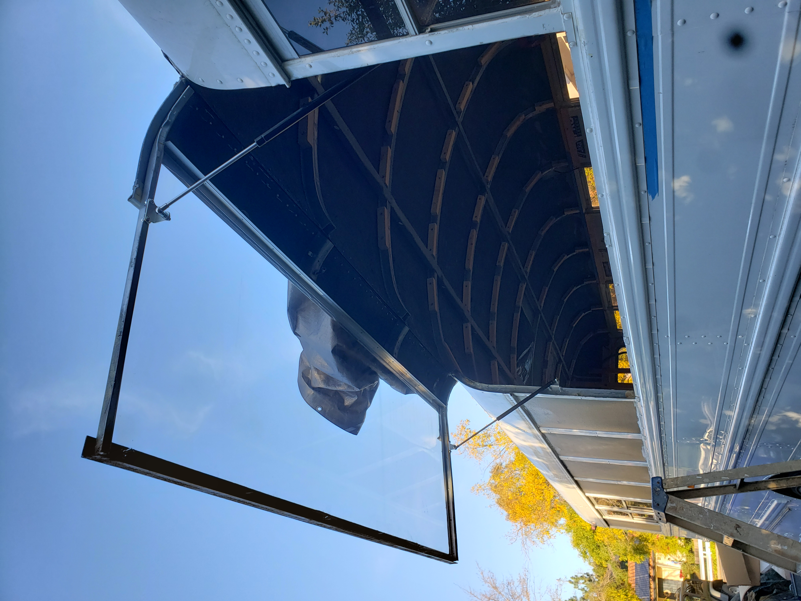

+++
date = 2019-07-16
title = "Hobbie Projects"
description = "A Curation of Wood and Metalworking Projects"
authors = ["Alyn Musselman"]
[taxonomies]
tags = ["CAD", "Woodworking", "Metalworking"]
[extra]
math = true
image = "bus4.jpg"
+++

## Animator's Table

A friend of mine introduced me to this neat little contraption called an Animator's Table. They were used by the very first Disney animators, and are even used today by very niche artists. I told my friend I was up for the challenge if he paid for the parts, and he agreed! After designing the table in SketchUp (the first CAD software I used) I was able to bring it to life in the real world.

## Flip-Up Bus Window

My brother bought a 40 foot school bus to do a conversion on. One of the stand-out features of these busses are the poor ventilation. So I decided to help out and design, fab, and finish the best bus window ever. It needed to be waterproof at 60mph, have hydraulic lifts, be at least 6 feet long (with a vertical nonlinear contour), weight under 200lbs, be UV-resistant, and the hardware could not cost more than 300 dollars. Well, I did it all for 75 bucks (plexiglass seperate).

