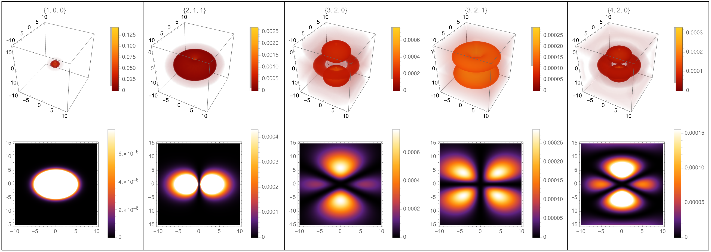

+++
date = 2023-05-09
title = "Hydrogen Orbitals Simulation"
description = "Deriving and visualizing the hydrogen wave function in Mathematica, and exploring the symmetry of its orbitals."
authors = ["Alyn Musselman"]
[taxonomies]
tags = ["Mathematica", "math"]
[extra]
math = true
image = "orbitals.png"
+++

## Motivation

One of the first profound ideas you meet in quantum mechanics is the standing
wave, and it appears in its grandest form in Schrödinger's time-dependent
equation:

$$
i \hbar \frac{\partial \Psi}{\partial t} = - \frac{\hbar^2}{2m} \nabla^2 \Psi + V \Psi .
$$

To a physicist this equation is profound; to a mathematician it is a close
relative of the diffusion equation, only with an imaginary coefficient on the
time derivative — which is exactly what turns spreading, decaying solutions into
*oscillating* standing waves.

In Griffiths' *Introduction to Quantum Mechanics* there is a beautiful figure of
density plots showing the probability distribution of the electron around the
hydrogen nucleus (a single proton). What strikes you immediately about that
figure is its symmetry. For this project — my final for M303 — I set out to
re-derive the hydrogen wave function myself and build a Mathematica notebook that
evaluates and plots it in 2D and 3D, so I could explore that symmetry directly.

## Methodology

For a single electron bound to a proton, the potential is the Coulomb attraction
$V(r) = -e^2 / (4\pi\varepsilon_0 r)$, which depends only on the radial distance
$r$. Because the potential is spherically symmetric, the time-independent
equation separates in spherical coordinates into a radial part and an angular
part. The stationary states are labeled by three integers — the **principal
quantum number** $n$, the **angular momentum** number $\ell$, and the
**magnetic** number $m$ — and the full wave function factorizes as

$$
\Psi_{n\ell m}(r, \theta, \phi) = R_{n\ell}(r)\, Y_{\ell}^{m}(\theta, \phi).
$$

**The radial part.** $R_{n\ell}(r)$ carries the dependence on distance from the
nucleus and is built from an **associated Laguerre polynomial** $L$:

$$
R_{n\ell}(r) = \sqrt{\left(\frac{2}{n a_0}\right)^{\!3} \frac{(n-\ell-1)!}{2n\,(n+\ell)!}}\;
e^{-r/n a_0} \left(\frac{2r}{n a_0}\right)^{\!\ell}
L_{n-\ell-1}^{\,2\ell+1}\!\left(\frac{2r}{n a_0}\right),
$$

where $a_0$ is the Bohr radius. The decaying exponential is what confines the
electron near the nucleus.

**The angular part.** $Y_\ell^m(\theta, \phi)$ is a **normalized spherical
harmonic**, which in turn contains an **associated Legendre polynomial**
$P_\ell^m$:

$$
Y_\ell^m(\theta, \phi) = \sqrt{\frac{(2\ell+1)}{4\pi}\frac{(\ell-m)!}{(\ell+m)!}}\;
P_\ell^m(\cos\theta)\, e^{i m \phi}.
$$

Conveniently, Mathematica ships both `LaguerreL` and `SphericalHarmonicY` as
built-in functions, so the notebook defines $\Psi$ directly. Picking values of
$(n, \ell, m)$ fixes all of the pieces, and substituting them back into
$\Psi_{n\ell m}$ gives a concrete wave function. The electron's **probability
density** is then $|\Psi_{n\ell m}|^2$, which is what actually gets plotted.

To make the orbitals explorable I wrapped the plots in `Manipulate`, with sliders
over $n$, $\ell$, and $m$ (and a sampling-resolution control). The 2D views are
`DensityPlot`s of $|\Psi|$ taken on a slice through the atom — in spherical terms
with $r = \sqrt{x^2 + z^2}$ and $\theta = \arctan(z, x)$ — and the 3D views are
volumetric density plots of the same quantity.

## Results

The figure shows several orbitals, each labeled by its quantum numbers
$\{n, \ell, m\}$: the top row gives the 3D probability density and the bottom row
the corresponding 2D slice. The familiar shapes all appear — the spherical
$1s$ state $\{1,0,0\}$, the dumbbell $\{2,1,1\}$, and the lobed orbitals at
$\{3,2,0\}$, $\{3,2,1\}$, and $\{4,2,0\}$.

What stands out is the **symmetry**. In the 2D slices, any line through the
center reflects one half of the image onto the other; in 3D, the same holds for
any plane through the origin. There are two reasons for this. The first is
physical: in deriving the wave function we required the electron to remain bound
near the nucleus, and that constraint restricts where it can be found into
symmetric patterns. The second — and the one I find more illuminating — is that
we are working in **spherical coordinates**. The angular variables $\theta$ and
$\phi$ don't run off to infinity along a straight line like Cartesian
coordinates; they wrap around and around, and that circling is what imprints the
circular and spherical symmetry onto the graphs.

A small one-dimensional analogy makes the point. Compare the Cartesian parabola
$y = x^2$ with the *same* squaring map written in polar form, $r = \theta^2$:

$$
y = x^2 \qquad \text{vs.} \qquad r = \theta^2 .
$$

They are the identical operation — take an argument, return its square — yet the
Cartesian version produces an up-down (vertical) symmetry while the polar version
wraps that parabola into a spiral with circular symmetry. The coordinate system,
not just the physics, is doing some of the symmetry work, and the hydrogen
orbitals are the three-dimensional version of exactly that effect.
