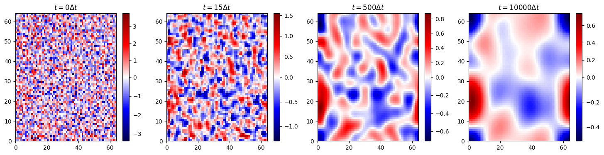
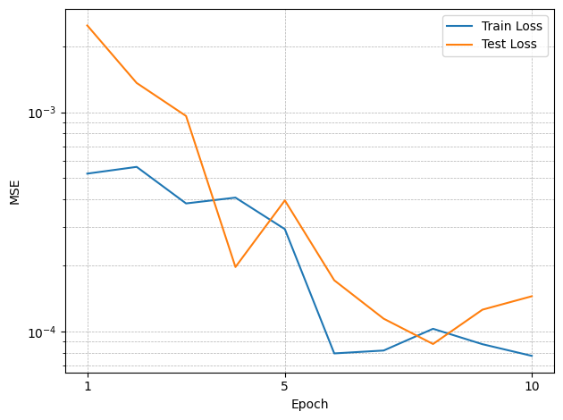
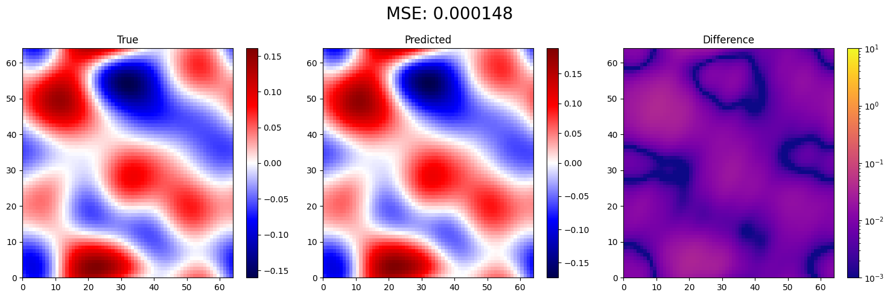
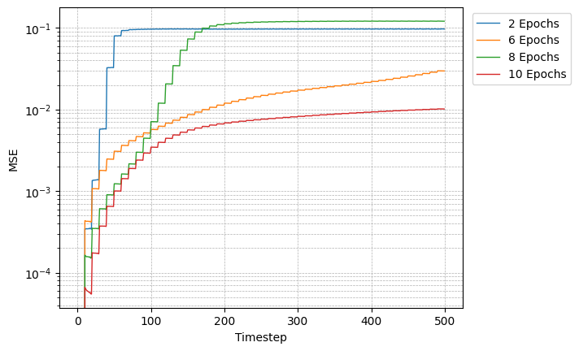

+++
date = 2025-06-11
title = "Learning the Cahn-Hilliard Equation with Fourier Neural Operators"
description = "Training a 2D Fourier Neural Operator to act as a fast surrogate solver for the Cahn-Hilliard equation."
authors = ["Alyn Musselman"]
[taxonomies]
tags = ["Pytorch", "math"]
[extra]
math = true
image = "single_sample.png"
+++

## Motivation

The Cahn-Hilliard equation models **phase separation** — the way a mixed binary
system (two substances, or two phases of one) spontaneously un-mixes into distinct
domains that slowly coarsen over time. It is a fourth-order, nonlinear, stiff PDE,
and resolving its dynamics with a classical solver is expensive: the stiffness
forces tiny timesteps, so marching a single simulation out to long times can mean
hundreds of thousands of steps.

This project asks whether a **Fourier Neural Operator (FNO)** can learn the
equation's dynamics and act as a fast surrogate. Unlike an ordinary network that
maps vectors to vectors, an FNO learns a mapping between *functions* — here, from
the recent history of the concentration field to its future. If it works, you get
a solver that advances the field in a single forward pass instead of thousands of
fine timesteps, and that generalizes across resolutions because its core operation
lives in Fourier space.

## Generating the Data

Training data comes from a high-fidelity **Dedalus** spectral solver run on the
non-dimensional Cahn-Hilliard equation,

$$
\frac{\partial u}{\partial t} = \nabla^2\!\left(\alpha^2 u^3 - u - \nabla^2 u\right),
$$

on a $64 \times 64$ periodic grid with $\Delta t = 10^{-5}$, $\Delta x = 0.01$,
and $\alpha = 0.1$. Each run starts from random noise and is integrated forward;
the figure below shows a single sample evolving from initial static to fully
coarsened phase domains.



At $t = 0$ the field is pure noise; by a few steps in, fine structure begins to
organize; and over thousands of steps the characteristic blob-like domains emerge
and grow. This whole trajectory is what the FNO has to learn to reproduce.

## The Fourier Neural Operator

The model is a standard 2D FNO. Its key building block is the **spectral
convolution layer**, which transforms the field into Fourier space, keeps only the
lowest modes, multiplies them by learned complex weights, and transforms back:

```python
class SpectralConv2d(nn.Module):
    def __init__(self, in_channels, out_channels, modes1, modes2):
        super().__init__()
        self.modes1, self.modes2 = modes1, modes2   # # of Fourier modes kept
        scale = 1 / (in_channels * out_channels)
        self.weights1 = nn.Parameter(scale * torch.rand(
            in_channels, out_channels, modes1, modes2, dtype=torch.cfloat))
        self.weights2 = nn.Parameter(scale * torch.rand(
            in_channels, out_channels, modes1, modes2, dtype=torch.cfloat))

    def compl_mul2d(self, input, weights):
        # FFT -> keep low modes -> multiply -> iFFT
        return torch.einsum("bixy,ioxy->boxy", input, weights)
```

Truncating to a fixed number of modes is what makes the operator *resolution
independent*: the learned weights act on frequencies, not pixels, so the same
model can be applied to grids of different sizes. I used **16 modes** and a
channel **width of 20**.

The learning task is set up as a sliding window in time: the input is a stack of
**10 consecutive timesteps** of the field, and the target is the **next 10
timesteps**.

```python
train_a = data[:n_train, :, :, :10]   # input: 10 past frames
train_u = data[:n_train, :, :, 10:]   # target: next 10 frames
```

Training uses an 80/20 train/test split, the Adam optimizer at a learning rate of
$10^{-3}$, MSE loss, and a learning-rate scheduler, for up to 10 epochs. Both the
training and test loss fall by more than an order of magnitude and track each
other closely, so the model isn't simply overfitting.



## Results

On held-out data the FNO reproduces the true field strikingly well. The panels
below compare the ground-truth field, the FNO prediction, and their pointwise
difference (note the logarithmic color scale on the difference) for a single
prediction window — the MSE is $\approx 1.5 \times 10^{-4}$, and the error is
diffuse and tiny rather than concentrated on any structure.



The harder test is **autoregressive rollout**: feed the model's own predictions
back in as input and let it march far beyond the window it was trained on. Here the
picture is more nuanced. Errors accumulate step by step, as they must for any
learned time-stepper, but the amount of training matters enormously. Rolling out
to 500 timesteps, the under-trained models saturate near $10^{-1}$ error almost
immediately, while the fully trained 10-epoch model keeps its error around
$10^{-2}$ across the entire horizon.



The takeaways:

- **As a one-shot surrogate, the FNO works well.** It predicts the next block of
  Cahn-Hilliard evolution to ~$10^{-4}$ MSE in a single forward pass, far faster
  than re-running the fine-timestep Dedalus solver.
- **Long rollouts are the real challenge.** Autoregressive error compounds, so
  pushing predictions hundreds of steps out degrades accuracy — though more
  training visibly flattens that growth, suggesting the rollout stability is
  partly a matter of how well the operator has been fit.
- **The spectral structure pays off.** Because the model operates on a fixed set
  of Fourier modes, it is naturally tied to the same spectral picture that makes
  Cahn-Hilliard tractable in the first place, and it inherits resolution
  flexibility for free.

This is an encouraging proof of concept that operator learning can stand in for an
expensive stiff PDE solver, with the next obvious direction being techniques to
tame the autoregressive error growth for genuinely long-horizon prediction.
