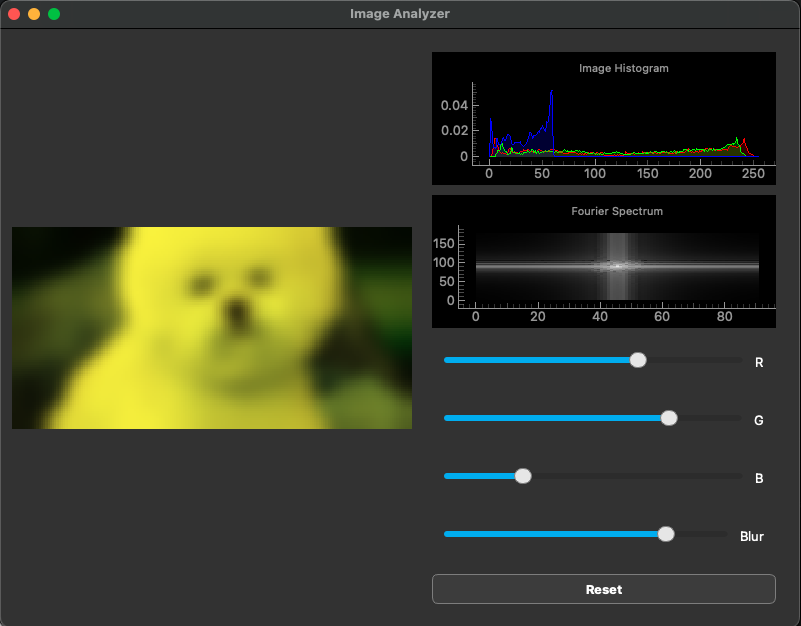

+++
date = 2025-10-28
title = "A Real-Time Image Analyzer in PyQt"
description = "A desktop app for interactive image filtering, channel adjustment, and live histogram/Fourier analysis."
authors = ["Alyn Musselman"]
[taxonomies]
tags = ["Python", "math"]
[extra]
math = true
image = "app_example.png"
+++

## Motivation

I wanted a small, self-contained desktop tool to interactively explore what
happens to an image when you tweak its color channels or blur it — and to see
those changes reflected immediately in the image's statistics. Rather than
re-running a script every time, the goal was a live GUI: drag in an image, move a
slider, and watch both the picture and its analytics update in real time.

The result is a PyQt6 + PyQtGraph application that pairs a drag-and-drop image
canvas with two live plots — an RGB histogram and a 2D Fourier spectrum — driven
by a handful of NumPy image operations.



## Methodology

The app is split cleanly into two pieces: a set of pure NumPy image functions
(`image_fncs.py`) and the PyQt GUI that wires them to widgets (`pyqt_gui.py`).
Images are loaded as `float32` RGBA arrays so that repeated transformations don't
accumulate integer-rounding error, and only clipped back to `uint8` at display
time.

### The image operations

**Channel intensity.** Each RGB slider scales one color channel by a factor
$\alpha = v/100$, where $v$ is the slider value. For channel $c$,

$$
I'_{c}(x,y) = \alpha \, I_{c}(x,y),
$$

leaving the other channels untouched. This is the cheapest of the operations —
a single broadcast multiply.

```python
def color_intensity(image, channel, intensity):
    adjusted_image = image[:, :, :3].copy()
    adjusted_image[:, :, channel] = adjusted_image[:, :, channel] * intensity
    return adjusted_image
```

**Box blur.** The blur is an unnormalized-kernel box filter of radius $r$. Each
output pixel is the mean of its neighbors within a $(r{+}1)\times(r{+}1)$ window,

$$
I'(x,y) = \frac{1}{|\mathcal{N}|} \sum_{(i,j)\in \mathcal{N}(x,y)} I(i,j),
$$

where $\mathcal{N}(x,y)$ is the set of in-bounds neighbors. It's implemented with
explicit loops, which is transparent but $O(W H r^2)$ — the most expensive
control in the app, and a natural candidate for a separable-kernel or FFT-based
speedup.

### The live analytics

**RGB histogram.** For each channel the app computes a normalized 256-bin
histogram (a density estimate of the pixel-intensity distribution) and draws all
three as filled curves:

```python
def image_histogram(image):
    hist, bins = np.empty((3, 256)), None
    for color in range(3):
        hist[color], bins = np.histogram(
            image[:, :, color].flatten(), bins=256, range=(0, 256), density=True)
    return hist, bins
```

**Fourier spectrum.** The image is converted to grayscale by averaging the
channels, then run through a 2D FFT. The zero-frequency component is shifted to
the center and the magnitude is log-scaled for display:

$$
F(u,v) = \mathcal{F}\{\,g(x,y)\,\}, \qquad
S(u,v) = \log\!\big(1 + |\,\text{fftshift}(F)\,|\big),
$$

with $g = (R + G + B)/3$. The $\log(1+\lvert\cdot\rvert)$ compression is what
makes the spectrum legible — raw FFT magnitudes span many orders of magnitude and
would otherwise show only the DC spike.

```python
def grayscale_fft(image):
    gray = (image[:, :, 0] + image[:, :, 1] + image[:, :, 2]) / 3.0
    fft = np.fft.fft2(gray)
    fft_shifted = np.fft.fftshift(fft)
    return np.log1p(np.abs(fft_shifted)).astype(np.float32)
```

### The GUI

The interface is a `QMainWindow` with the image canvas on the left and a vertical
stack on the right holding the two PyQtGraph plots, four sliders (R, G, B, and
Blur), and a reset button. Images arrive via drag-and-drop: `dropEvent` reads the
file into a QImage, exposes the raw buffer as a NumPy array, and keeps both an
untouched original and a working copy. Every slider movement re-derives the
working copy from the original, re-renders the canvas, and refreshes both plots,
so the histogram and spectrum always track exactly what's on screen.

## Results

The finished app loads any dropped image and responds to channel and blur
adjustments in real time, with the histogram and Fourier spectrum updating live
alongside the picture. It's a compact demonstration of coupling NumPy
image processing to a responsive PyQt/PyQtGraph front end — and a clean base to
extend with more filters (the box blur, in particular, is the obvious first
target for an FFT-based reimplementation).

Dependencies are minimal: PyQt6, PyQtGraph, and NumPy, with Jupyter and
Matplotlib used only for the unit tests.
