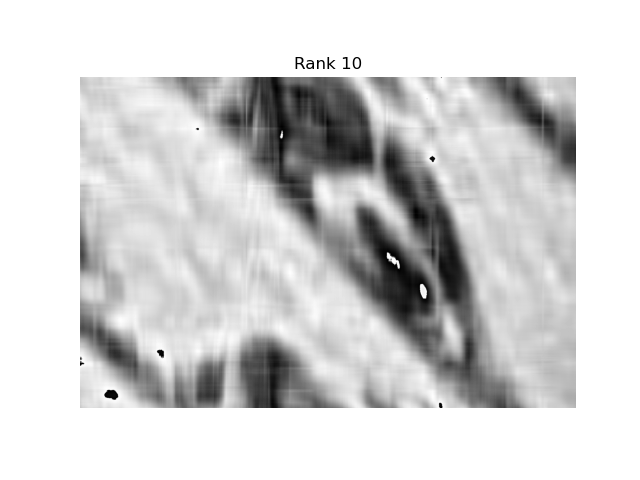
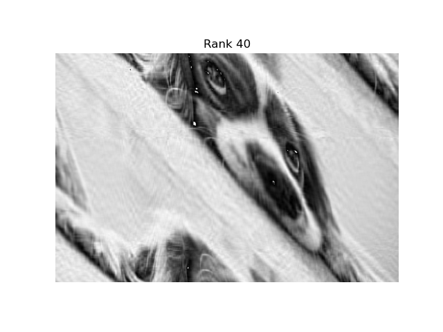

+++
date = 2024-03-20
title = "Image Compression with the SVD in C++"
description = "Using LAPACK to take the singular value decomposition of a high-resolution image and compress it by low-rank truncation."
authors = ["Alyn Musselman"]
[taxonomies]
tags = ["math", "Statistics"]
[extra]
math = true
image = "K_160.png"
+++

## Motivation

The singular value decomposition is one of the most useful factorizations in
numerical linear algebra, and image compression is its most visual demo. A
grayscale image is just a matrix of pixel intensities; the SVD lets you keep only
the handful of directions that carry the most information and throw the rest
away. This was the SVD half of my AM213A final project: load a high-resolution
image as a matrix in C++, compute its SVD with **LAPACK**, and reconstruct it at
a sequence of ranks to watch quality trade against compression.

The test image is a $1279 \times 1920$ grayscale photo of a dog, read in as a
matrix of doubles.

## The Math

Any real $m \times n$ matrix $A$ factors as

$$
A = U \Sigma V^{T},
$$

where $U \in \mathbb{R}^{m\times m}$ and $V \in \mathbb{R}^{n\times n}$ are
orthogonal and $\Sigma$ is diagonal with the singular values
$\sigma_1 \ge \sigma_2 \ge \dots \ge 0$ on its diagonal. Because the singular
values are sorted, the sum

$$
A = \sum_{i=1}^{r} \sigma_i\, u_i v_i^{T}
$$

is dominated by its first few terms. The **rank-$K$ truncation** keeps only the
$K$ largest singular values,

$$
A_K = \sum_{i=1}^{K} \sigma_i\, u_i v_i^{T},
$$

which the Eckart–Young theorem guarantees is the *best* rank-$K$ approximation of
$A$ in both the spectral and Frobenius norms. In practice I built $A_K$ by zeroing
out every diagonal entry of $\Sigma$ past index $K$ and re-multiplying
$U \Sigma_K V^{T}$.

The savings: instead of storing $m \times n$ numbers, a rank-$K$ image needs only
$K(m + n + 1)$ — the kept columns of $U$, rows of $V^{T}$, and singular values.
For this image, $K = 160$ stores roughly 12% of the original data.

## The C++ Implementation

The heavy lifting is done by `dgesvd`, the LAPACK double-precision SVD routine,
called here through Apple's Accelerate framework. (LAPACK is the modern successor
to the original LINPACK library.) The workflow in `driver.cpp`:

1. Read the `.dat` pixel file into a `vector<vector<double>>`, then flatten it
   into a **column-major** `double*` array — the layout LAPACK expects.
2. Call `dgesvd_` with `JOBU = JOBVT = 'A'` to get the full $U$, $\Sigma$, and
   $V^{T}$.
3. Rebuild $\Sigma$ as a diagonal matrix, then loop over a list of target ranks,
   zeroing the tail of $\Sigma$ and reconstructing.

```cpp
char JOBU = 'A', JOBVT = 'A';
int M = 1279, N = 1920, LDA = M, LDU = M, LDVT = N;
int mn = min(M, N), MN = max(M, N);
int LWORK = 2 * max(3*mn + MN, 5*mn);
int INFO;

double* S    = new double[mn];
double* U    = new double[LDU*M];
double* VT   = new double[LDVT*N];
double* WORK = new double[LWORK];

dgesvd_(&JOBU, &JOBVT, &M, &N,
        doggy_arr, &LDA,
        S, U, &LDU, VT, &LDVT,
        WORK, &LWORK, &INFO);
```

The compression loop sweeps $K \in \{1279, 640, 320, 160, 80, 40, 20, 10\}$:

```cpp
int k[8] = {1279, 640, 320, 160, 80, 40, 20, 10};
for (int i = 0; i < 8; i++) {
    for (int j = 0; j < M; j++)
        if (j > k[i]) Sdag[j][j] = 0;      // truncate Sigma

    US = matrixmult(Uvec, Sdag);
    auto USVT2 = matrixmult(US, VTvec);    // reconstruct A_K

    auto diff = difference(USVT, USVT2);   // error vs full-rank
    double err = frobnorm(diff) / (M*N);
}
```

Reconstruction error is measured with the **Frobenius norm**, computed via
$\lVert A \rVert_F = \sqrt{\operatorname{tr}(A^{T} A)}$, then normalized by the
pixel count:

```cpp
double frobnorm(vector<vector<double>> A) {
    auto AT  = transpose(A);
    auto ATA = matrixmult(AT, A);
    return sqrt(trace(ATA, A.size()));
}
```

## Results

The reconstructions show how quickly the image becomes recognizable. At rank 10
only the broadest light/dark structure survives; by rank 40 the subject is
clearly emerging; rank 160 is visually close to the original; and rank 1279
(full) is the exact image.





## Key Takeaways

The project distilled down to a few lessons:

- **A few singular values carry most of the picture.** Because $\sigma_i$ decays
  fast, low ranks reconstruct a faithful image — the SVD concentrates information
  into its leading modes, which is exactly why it compresses.
- **Eckart–Young makes truncation optimal.** Zeroing the smallest singular values
  isn't a heuristic; it provably gives the best possible rank-$K$ approximation,
  so there's no better way to spend a fixed storage budget.
- **Memory layout is the real work of calling LAPACK.** `dgesvd` is one function
  call; getting the image into the column-major `double*` it expects, sizing the
  `LWORK` workspace, and shuttling $U$, $\Sigma$, $V^{T}$ back into matrices was
  the bulk of the C++.
- **Compression vs. fidelity is a tunable knob.** Sweeping $K$ and tracking the
  normalized Frobenius error turns "how compressed?" into a quantitative curve
  rather than a guess — error falls monotonically as $K$ grows, with diminishing
  returns past the point where the image already looks right.
