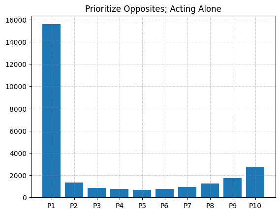

+++
date = 2024-12-20
title = "Statistical Analysis of LRC"
description = "Using Monte Carlo to test strategies in the game 'Left, Center, Right'"
authors = ["Alyn Musselman"]
[taxonomies]
tags = ["Statistics", "math"]
[extra]
math = true
image = "strat1.png"
+++

## Motivation

*Left-Center-Right* (LCR) is a dice game of pure luck. Each player starts with a
small pile of chips, and on your turn you roll one die for each chip you hold (up
to three). The faces tell you what to do: **L** passes a chip left, **R** passes
a chip right, **C** puts a chip in the center pot, and a **dot** means keep it.
The last player with chips wins. Crucially, the standard game offers no
decisions — the dice decide everything, so there is no strategy to speak of.

The *Wild* variant changes this. It adds a **WILD** face that lets the roller
take a chip from *any* player of their choosing (and rolling three WILDs sweeps
the entire center pot). Suddenly there is a sliver of autonomy. The question that
motivated this project: given that limited freedom, **what is the best use of
it?** Is there a meaningful strategy, or does the game's inherent randomness wash
out any advantage?

To answer that, I built a Monte Carlo simulation of the game and pitted a chosen
strategy against players acting under a default rule.

## Methodology

The game is modeled directly in NumPy. There are $N = 10$ players seated in a
ring, each starting with 5 chips. "You" are player 0; everyone else plays a
naive baseline. A roll draws three faces from the die

$$
\text{die} = \{\,L,\ C,\ R,\ \text{dot},\ \text{dot},\ \text{WILD}\,\},
$$

so each face has probability $1/6$ except the dot, which has probability $2/6$.

A turn resolves the ordinary faces first — L and R move chips to neighbors, C
moves a chip to the center — and then handles any WILDs:

```python
die = np.array(['L','C','R','DOT','DOT','WILD'])

def doroll():
    return np.array([np.random.choice(die) for i in range(3)])
```

**The baseline rule.** When a generic player rolls a WILD, they greedily take
from whoever currently has the largest stack:

```python
elif playerID:                      # any player that isn't "you"
    banks[playerID] += WILDcount
    banks[np.argmax(banks)] -= WILDcount
```

**My strategy (player 0).** Rather than always hitting the global leader, I look
*across the table* — at the player seated opposite me and their immediate
neighbors — and take from the wealthiest of that group. If none of them have
chips, I fall back to taking from the richest player who is furthest from me:

```python
def strategy(playerID, WILDcount):
    # if the players across the table have money, take from the richest of them
    if np.count_nonzero(banks[playerID + N//2 - 1 : playerID + N//2 + 1]):
        banks[np.argmax(banks[playerID + N//2 - 1 : playerID + N//2 + 1])] -= WILDcount
    # otherwise take from the player with money furthest from you
    else:
        who_has_money = np.nonzero(banks)[0]
        take_from = min(who_has_money, key=lambda x: abs(x - N//2))
        banks[take_from] -= WILDcount
```

The intuition is that depleting players *across* the table — rather than feeding
the global-leader dynamic that everyone else plays into — keeps chips circulating
away from your immediate neighbors, who can pass chips straight back to you.

A round lets every solvent player take a turn; a game runs until only one player
has chips left:

```python
def play_a_game():
    while np.count_nonzero(banks) > 1:
        play_a_round()
```

To estimate the win probability of the strategy, the whole game is replayed
$n_\text{games} = 10{,}000$ times and player 0's win rate is tallied. With a fair
game and no strategy, each of the 10 players would win about $1/N = 10\%$ of the
time; the question is whether the strategy pushes player 0 meaningfully above
that baseline.

## Results



Across the Monte Carlo runs, the central comparison is between player 0's
observed win rate and the $10\%$ chance expected under pure luck. Because the
game is dominated by randomness, the autonomy granted by the WILD face produces
only a modest shift — the limited freedom the *Wild* variant allows is exactly
that: limited. The simulation framework, however, makes it straightforward to
swap in alternative `strategy()` rules and re-run the 10,000-game sweep to
compare their win rates head-to-head.
