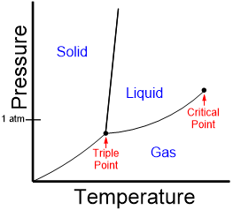
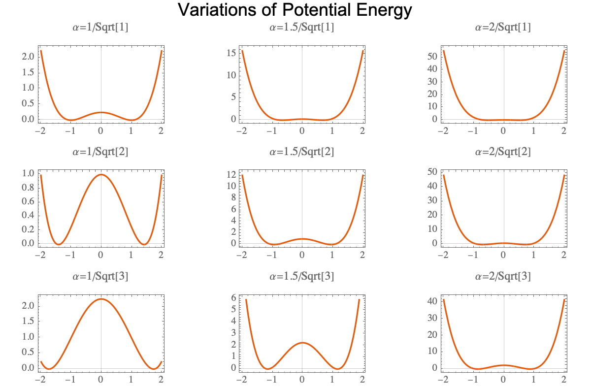
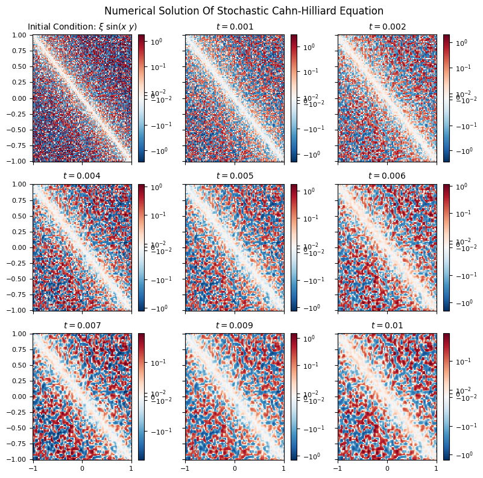
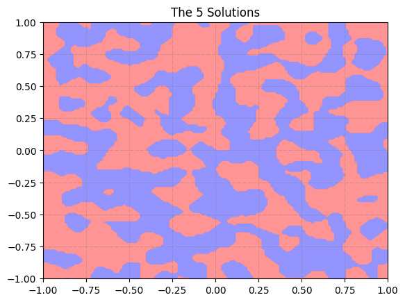
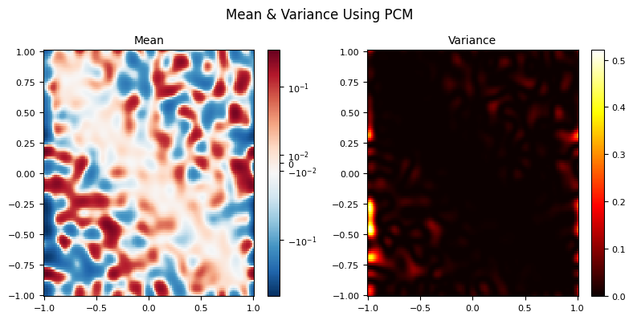
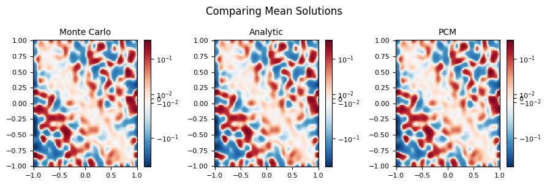

+++
date = 2024-09-20
title = "Uncertainty Quantificaton of Stochastic Nonlinear PDEs"
description = "Four UQ strategies — Monte Carlo, DO, gPC, and PCM — applied to a stochastic Cahn-Hilliard equation."
authors = ["Alyn Musselman"]
[taxonomies]
tags = ["Statistics", "math"]
[extra]
math = true
image = "mean_solutions_compared_colorbar.png"
+++

## Motivation

The Cahn-Hilliard equation is a fourth-order, nonlinear, time-dependent PDE that
models **phase separation** in a binary mixture — think of two substances (or two
phases of one substance) un-mixing into distinct regions. It shows up all over
materials science, and like most equations of its kind it cannot be solved
analytically.

For this project (my AM 238 research project with Daniele Venturi) I made the
problem *stochastic*: I injected noise into the potential-energy function that
governs how the mixture separates. The result is a stochastic, nonlinear,
fourth-order PDE, and the question becomes one of **uncertainty quantification** —
not "what is the solution?" but "what is the *mean* and *variance* of the solution
field given a random input?" The traditional answer is Monte Carlo, but Monte
Carlo needs an enormous number of samples to converge and quickly becomes too
expensive. The goal here was to see whether smarter sampling methods could match
Monte Carlo's accuracy at a fraction of the cost.

I evaluate four strategies for the mean-field solution: **Monte Carlo**,
**Dynamically Orthogonal (DO) field equations**, **generalized Polynomial Chaos
(gPC)**, and the **Probabilistic Collocation Method (PCM)**.

## The Cahn-Hilliard Model

Let $u(\mathbf{x}, t)$ be the local concentration, scaled so that $u < 0$ marks
phase $A$ and $u > 0$ marks phase $B$. With a chemical potential $\mu$, Fick's
first law $\mathbf{J} = -D\nabla\mu$ and conservation of mass
($\partial_t u + \nabla\cdot\mathbf{J} = 0$) give the general Cahn-Hilliard form

$$
\frac{\partial u}{\partial t} = \nabla\cdot(D\,\nabla\mu).
$$

The physics of separation lives in $\mu$. Starting from a Landau free energy and
keeping the symmetric double-well shape, the potential is built as
$F(T^*, u) = \tfrac{1}{4}\big(a - (bu)^2\big)^2$, where $a, b$ depend on
temperature $T$. For $a < 0$ the well has a single minimum; as $a$ crosses zero a
**bifurcation** creates two minima separated by an energy barrier at $u = 0$ — and
that double well is exactly what drives the mixture apart.

Adding a gradient-energy term $\tfrac{\gamma}{2}|\nabla u|^2$ (which penalizes
fine-scale mixing and forces the material into distinct domains) and
non-dimensionalizing reduces the model to

$$
\frac{\partial u}{\partial \hat{t}} = \nabla^2\!\left(\alpha^2 u^3 - u - \nabla^2 u\right),
\qquad \alpha = \frac{b}{\sqrt{a}}.
$$

The single parameter $\alpha$ sets the shape of the potential about $u = 0$: small
$\alpha$ pulls particles to their phase minima quickly, larger $\alpha$ more
slowly. This is the knob I perturb to model real-world noise.

### Making it stochastic

In a real system the temperature is never perfectly fixed, and those fluctuations
change $a$ and $b$ — and therefore $\alpha$. Promoting $\alpha \to \alpha(\xi)$
for a random variable $\xi$ turns the model into a stochastic PDE,

$$
\frac{\partial u(\mathbf{x}, t, \xi)}{\partial \hat{t}}
= \nabla^2\!\left(\alpha(\xi)^2 u^3 - u - \nabla^2 u\right).
$$

Phase separation requires $0 < \alpha \ll 1$, so I take $\alpha$ **uniform** on
$\Omega = [0.001, 0.1]$ (exponential and Gaussian PDFs are hard to sample
reliably at this scale). The plots below show how the potential's shape varies
with $\alpha$.

### Numerical solver

Every method below rests on the same deterministic solver: **second/fourth-order
finite differences** in space (a 5-point stencil for $\partial_{xx}$ and a 5-point
stencil for $\partial_{xxxx}$, etc.) and an explicit **3-step Runge-Kutta** scheme
in time,

$$
u^{t+1} = u^{t} + \frac{\Delta t}{6}\left(k_1 + 4k_2 + k_3\right),
$$

with $\Delta x = \Delta y = 0.017$, $\Delta t = 10^{-5}$, and $\mathbf{x} \in
[-1,1]^2$. Starting from a random initial field, this resolves the characteristic
coarsening of the two phases over time.

## The Four UQ Methods

**Monte Carlo.** Draw many samples of $\alpha$, solve the deterministic PDE for
each, and average. It is simple and unbiased — the mean and variance are just the
empirical mean and variance over the ensemble — and I use a **5000-sample** run as
the reference "truth." Its weakness is cost: the error shrinks only like
$1/\sqrt{N}$, so high accuracy demands enormous $N$.

**Dynamically Orthogonal (DO) field equations.** Expand the solution as a mean
plus a sum of orthogonal spatial modes carrying zero-mean stochastic
coefficients, $u = \bar{u} + \sum_i \hat{u}_i(\mathbf{x},t)\,Y_i(t,\xi)$, evolved
under the dynamically-orthogonal constraint. In principle this propagates only the
handful of modes that matter. In practice, applying it to Cahn-Hilliard produces
products of high-order derivatives ($\partial^n\hat u_i\,\partial^n\hat u_j$) that
**diverge** for non-smooth initial data, and the propagator contains
fourth-order tensors whose per-timestep flop count is intractable. **Conclusion:
too expensive and too algorithmically complex to solve here.**

**Generalized Polynomial Chaos (gPC).** Expand the solution in a basis of
polynomials $P_k(\xi)$ that are orthogonal with respect to the input PDF,
$u(\mathbf{x},t,\xi) = \sum_k \hat{u}_k(\mathbf{x},t)\,P_k(\xi)$, build the basis
with the Stieltjes recurrence, and project the PDE onto each basis function to get
a coupled system of deterministic PDEs. The mean is then $\hat u_0$ and the
variance is $\sum_k \hat u_k^2\,\mathbb{E}\{P_k^2\}$. Unfortunately the projection
generates the *same* divergent derivative-product terms as DO, and a flop count
makes it concrete: even a coarse $N=100$ grid, $M=10$ modes, and 1000 steps costs
~3 teraflops for just the **first part of the first term**. **Conclusion: also too
expensive.**

**Probabilistic Collocation Method (PCM).** This is the method that works. Instead
of coupling the modes, PCM evaluates the solution at carefully chosen
**collocation nodes** $\xi^j$ in the support of the input PDF,
$u(\mathbf{x},t,\xi) \approx \sum_j u_j(\mathbf{x},t,\xi^j)\,P_j(\xi)$, which
yields an **uncoupled** family of deterministic PDEs — one per node — each solved
with the same RK solver as before. I generate the nodes and weights as
Gauss-quadrature points via the Stieltjes algorithm (the eigenvalues/eigenvectors
of the recurrence matrix $S$). With $M = 5$ nodes the mean and variance are simple
weighted sums,

$$
\mathbb{E}\{u\} \approx \sum_{j} w_j\, u_j,
\qquad
\mathrm{Var}\{u\} \approx \sum_{j} w_j\, u_j^2 - \Big(\sum_j w_j\, u_j\Big)^2 .
$$

Because the system is uncoupled, there are no divergent cross-terms and the cost
is just five deterministic solves.

## Results

The headline comparison is PCM against the 5000-sample Monte Carlo reference (and
the analytic mean). The mean fields are visually indistinguishable — PCM
reproduces the Monte Carlo answer using only **five** deterministic solves rather
than five thousand.

The takeaways:

- **Monte Carlo works but is wasteful** — accurate, unbiased, and the natural
  baseline, but its $1/\sqrt{N}$ convergence makes high accuracy very costly.
- **DO and gPC are elegant but impractical here.** Both reduce the SPDE to
  deterministic systems in theory, but Cahn-Hilliard's nonlinearity produces
  diverging high-order derivative products and tensor terms with intractable flop
  counts. They are dead ends *for this particular equation*.
- **PCM is the winner.** By decoupling the stochastic problem into a few
  independent deterministic solves at Gauss-quadrature nodes, it sidesteps the
  divergence entirely and matches the Monte Carlo mean field at a tiny fraction of
  the cost — roughly three orders of magnitude fewer solves in this experiment.

The broader lesson is that the "obvious" spectral UQ methods (DO, gPC) are not
universally applicable: a strongly nonlinear, high-order operator can break them,
and a well-chosen collocation scheme can be both simpler and dramatically cheaper.
